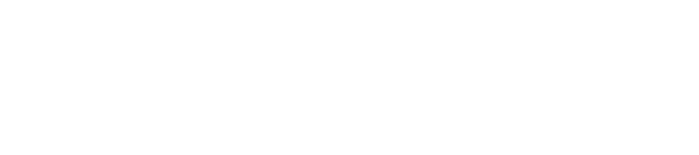

    <a href="https://matipretz.github.io/fullstackoeste"><h1>Full Stack Oeste - TPO - CaC 4.0 Q2 - Com 23542</h1></a>
    
      

## Menú
A. [Título y Descripción del Proyecto](#título-y-descripción-del-proyecto)

B. [Público Objetivo](#público-objetivo)   

C. [Estructura del Sitio](#estructura-del-sitio)

D. [Diseño y Estilo](#diseño-y-estilo)

E. [Contenido y Funcionalidades](#contenido-y-funcionalidades)
  
1. [Vistas](#vistas)
    
2. [Responsividad](#responsividad)
    
3. [CSS](#css)
    
4. [Scripts](#scripts)
      
   - [createIconList](#createIconList)
 
   - [loader](#loader)
 
   - [viewShow](#viewShow)
 
   - [submit](#submit)
 
   - [toggler](#toggler)
 
   - [quotes](#quotes)
 
F. [Integrantes del Equipo](#integrantes-del-equipo)

G. [Recursos Adicionales](#recursos-adicionales)

H. [Links](#links)

## Título y Descripción del Proyecto:
- Título: "Portal digital de Full Stack Oeste"
- Descripción: Creación de un portal web para "Full Stack Oeste", con el objetivo de ofrecer servicios de desarrollo web y marketing digital a potenciales clientes.

## Público Objetivo:
- Personas que están buscando establecer o mejorar su presencia en línea, y que necesitan servicios de desarrollo web y marketing digital, como ser: Emprendedores y dueños de negocios, PYMEs, profesionales independientes, etc. Aquellos que requieren orientación y asesoramiento profesional en el desarrollo de sus proyectos web.

## Estructura del Sitio:
- Home: Ofrece soluciones tecnológicas personalizadas para clientes.
- Servicios: Detalla los servicios de Full Stack Oeste.
- Nosotros: Integrantes y breve descripción de los valores y la visión del grupo.
- Contacto: Proporciona un formulario para enviar mensajes.

## Diseño y Estilo:
- Estilo visual: Relajado, moderno y tecnológico.
- Colores: Nuestra paleta se basa en colores claros acompañados de elementos blancos, para transmitir frescura y amabilidad. Adoptamos un tema alternativo oscuro con una combinación predominante de negro y grises, equilibrado con elementos llamativos y tonos claros. 
- Tipografía: Fuente estilizada en titulares y cabeceras, Sans-serif para una legibilidad óptima en textos de cuerpo.

## Contenido y Funcionalidades:
### Vistas: 
- Se optó por un sistema de vistas rudimentario, mostrando y ocultando el contenido HTML de cada vista por medio de un script propio.
### Responsividad: 
- Se estudiaron metodos modernos con la simplicidad como requisito fundamental. Se utilizan unidades relativas y propiedades avanzadas de CSS. 
- Las fuentes son reescaladas dinamicamente en proporcion al width del viewport por medio de la propiedad de calculo que ofrece CSS. 
- Las secciones con grids se escalan y disponen automaticamente gracias a grid-template y la propiedad minmax
### CSS: 
- Se utiliza ampliamente un sistema sencillo de variables para determinar la paleta de colores y las fuentes.
### Scripts:
- #### createIconList: 
    Simulamos el consumo de una API, primero componiendo un arreglo con rutas de iconos (tomando una ruta base y "mapeando" una lista) y luego renderizando una serie de iconos dispuestos en un grid responsivo.
- #### loader: 
    Tomamos el CSS y el HTML de un loader que se muestra por sobre toda la pagina y se oculta cuando termina de cargar el DOM.
- #### viewShow: 
    Es el script que muestra y oculta las vistas para lograr una aplicacion de una sola pagina (SPA). 
- #### submit: 
    Previene el comportamiento predefinido y verifica el campo de nombre y un patron en el campo de mail. Si obtiene true && true, dispara un alert y envia el formulario a UnStatic.
- #### toggler: 
    Este script apendiza un archivo CSS en el head del documento. Incluye estilos que pisan los colores por defecto, logrando cambiar el tema. Se vale de local storage para persistir la eleccion del usuario a tra vez de las sesiones. Se activa por medio de un checkbox estilizado como slider.
- #### quotes:
    Tomamos una base de datos de citas relacionadas a la computacíon y la subimos a firebase para interactuar con ella por medio de el metodo GET de API REST para renderizar una marquesina que muestra las citas junto con su autor de forma alternativa y al azar.
### Formulario de contacto:
- Integra [UnStatic](https://forms.un-static.com/), un servicio controlador de correo que remite el formulario sin exponer la casilla.
- A pesar de que se cuenta con validacion incorporada, se opto por utilizar un script estandar para validar las casillas de nombre y de correo.

## Integrantes del Equipo:
- [Matias Martin Murad Pretz](https://www.linkedin.com/in/matiasmurad/) (representante)
- Ricardo Torales
- Eliana Balbuena
  
## Recursos Adicionales:
- [prefixfree](https://github.com/LeaVerou/prefixfree): Ofrece la mayor compatibilidad posible con el motor webkit.
- [Favicon](https://favicon.io/): Generador de favicon.
- [FontAwesome](https://fontawesome.com/): Resuelve los iconos utilizados en el footer.
- [Dall-E](https://openai.com/dall-e-2): Generamos avatares para las tarjetas de los miembros.
- [StorySet](https://storyset.com/): Ilustraciones vectorizadas utilizadas en el home.
- [Google Fonts](https://fonts.google.com/): Importamos las familias Orbitron y Noto Sans Display.
- [MetaTags.io](https://metatags.io/): Genera meta-tags de forma automatica.
- [SimpleIcons](https://simpleicons.org/): Iconos vectorizados.
- [javaScript-Minifier](https://www.toptal.com/developers/javascript-minifier/): Minificado de JS.
- [PurifyCSS](https://purifycss.online/): Limpiador de CSS
- [Tinypng](https://tinypng.com/): Compresor de imagenes.
- [Firebase](https://firebase.google.com/): Alojamiento de JSON.
- [Adobe Express SVG](https://new.express.adobe.com/tools/convert-to-svg)

## Links:
- [Contacto](mailto:mati.pretz+dev@googlemail.com?subject=[FSO])
- [Repositorio](https://github.com/matipretz/fullstackoeste)
- [Sitio](https://matipretz.github.io/fullstackoeste)
- [Paleta de colores](https://coolors.co/visualizer/161B22-004643-101010-21262D)

### [<svg height="1rem" viewBox="0 0 512 512"><path d="M256 48a208 208 0 1 1 0 416 208 208 0 1 1 0-416zm0 464A256 256 0 1 0 256 0a256 256 0 1 0 0 512zM135.1 217.4c-4.5 4.2-7.1 10.1-7.1 16.3c0 12.3 10 22.3 22.3 22.3H208v96c0 17.7 14.3 32 32 32h32c17.7 0 32-14.3 32-32V256h57.7c12.3 0 22.3-10 22.3-22.3c0-6.2-2.6-12.1-7.1-16.3L269.8 117.5c-3.8-3.5-8.7-5.5-13.8-5.5s-10.1 2-13.8 5.5L135.1 217.4z" fill="grey"/></svg> Subir](#menú)