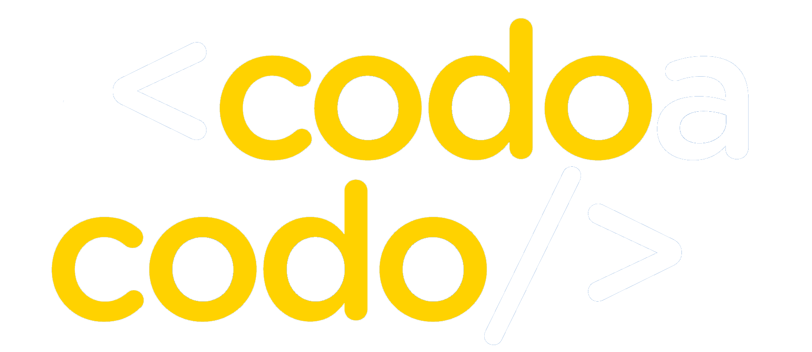

    <a href="https://matipretz.github.io/fullstackoeste"><h1>Full Stack Oeste - TPO - CaC 4.0 Q2 - Com 23542</h1></a>
    
      

1. [Título y Descripción del Proyecto](#título-y-descripción-del-proyecto)
2. [Público Objetivo](#público-objetivo)   
3. [Estructura del Sitio](#estructura-del-sitio)
4. [Diseño y Estilo](#diseño-y-estilo)
5. [Contenido y Funcionalidades](#contenido-y-funcionalidades)
6. [Integrantes del Equipo y Representante](#integrantes-del-equipo-y-representante)
7. [Recursos Adicionales](#recursos-adicionales)
8. [Links](#links)

## Título y Descripción del Proyecto:
- Título: "Portal digital de Full Stack Oeste"
- Descripción: Creación de un portal web para "Full Stack Oeste", con el objetivo de ofrecer servicios de desarrollo web y marketing digital a potenciales clientes.

## Público Objetivo:
- Personas que están buscando establecer o mejorar su presencia en línea, y que necesitan servicios de desarrollo web y marketing digital, como ser: Emprendedores y dueños de negocios, PYMEs, profesionales independientes. Aquellos que requieren orientación y asesoramiento profesional en el desarrollo de sus proyectos web.

## 3. Estructura del Sitio:
- Home: Descripción: Ofrece soluciones tecnológicas personalizadas para clientes.
- Servicios: Detalla los servicios de Full Stack Oeste.
- Nosotros: Integrantes y breve descripción de los valores y la visión del grupo.
- Contacto: Proporciona un formulario para enviar mensajes.

## Diseño y Estilo:
- Estilo visual: Relajado, moderno y tecnológico.
- Colores: Blanco, grises y verdes.
- Tipografía: Fuente estilizada en titulares y cabeceras, Sans-serif para una legibilidad óptima en textos de cuerpo.

## Contenido y Funcionalidades:
- Vistas: 
  - Se optó por un sistema de vistas rudimentario, mostrando y ocultando el contenido HTML de cada vista por medio de un script propio.
- Responsividad: 
  - Se estudiaron metodos modernos con la simplicidad como requisito fundamental. Se utilizan unidades relativas y propiedades avanzadas de CSS. 
  - Las fuentes son reescaladas dinamicamente en proporcion al width del viewport por medio de la propiedad de calculo que ofrece CSS. 
  - Las secciones con grids se escalan y disponen automaticamente gracias a grid-template y la propiedad minmax
- CSS: 
  - Se utiliza ampliamente un sistema sencillo de variables para determinar la paleta de colores y las fuentes.
- Scripts:
  - Simpleicons: Simulamos el consumo de una API, primero componiendo un arreglo con rutas de iconos (tomando una ruta base y "mapeando" una lista) y luego renderizando una serie de iconos dispuestos en un grid responsivo.
  - Loader: Tomamos el CSS y el HTML de un loader que se muestra por sobre toda la pagina y se oculta cuando termina de cargar el DOM.
  - viewShow: Es el script que muestra y oculta las vistas. Dada su extension se encuentra documentado en assets/scripts/scripts.js
 - Formulario de contacto:
   - Integra [UnStatic](https://forms.un-static.com/), un controlador de correo que remite el formulario sin exponer la casilla.
   - Ingegra [reCaptcha](https://www.google.com/recaptcha/about/), el servicio de google que evita rastreo de bots y potencial spam.

## Integrantes del Equipo:
- [Matias Martin Murad Pretz](https://www.linkedin.com/in/matiasmurad/) (representante)
- Patricia Feltan
- Ricardo Torales
- Eliana Balbuena
  
## Recursos Adicionales:
- [prefixfree](https://github.com/LeaVerou/prefixfree) para ofrecer la mayor compatibilidad posible con el motor webkit.
- [fontawesome](https://fontawesome.com/) resuelve los iconos utilizados en el footer.
- [storyset](https://storyset.com/) ofrece ilustraciones vectorizadas utilizadas en el home.
- [Google Fonts](https://fonts.google.com/) importamos las familias Orbitron, Pridi y Chivo Mono.
- [metatags.io](https://metatags.io/) genera tags de forma automatica.
- [simpleiconso](https://simpleicons.org/) iconos vectorizados.

## Links:
- [Contacto](mailto:contact.me@altmails.com?subject=[FSO])
- [Sitio](https://matipretz.github.io/fullstackoeste)
- [Paleta de colores](https://coolors.co/visualizer/252525-004643-101010-F0FFF0)

